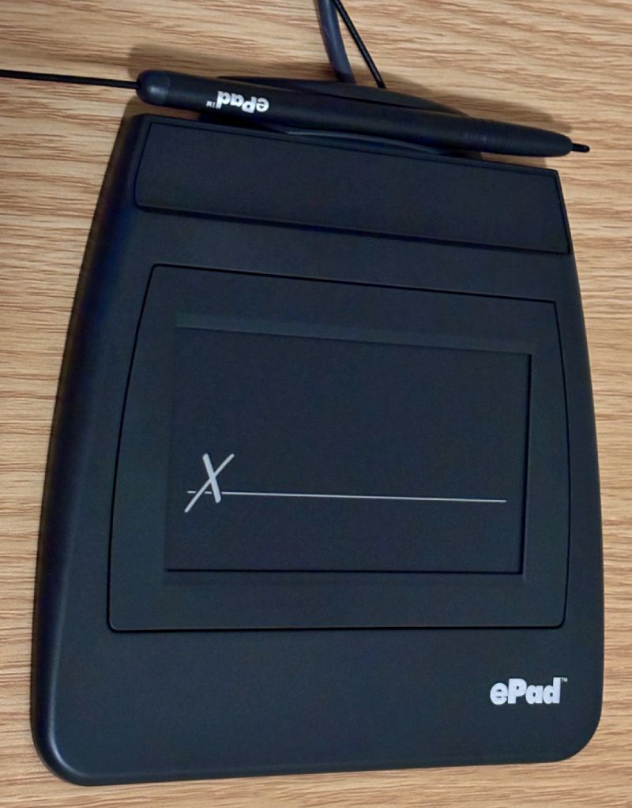

# epad-signature-pad-hid-driver

Unofficial Python driver for the ePadLink "ePad" USB signature pad (VID `0x04DF`,
PID `0x0012`), talking to it directly over raw USB HID.

## What is this device?



This is an **ePadLink "ePad"** USB electronic signature capture pad, made by
Interlink Electronics / ePadLink. When plugged in, it identifies itself over USB
as `"ePadLink USB ePad"`, with USB vendor ID `0x04DF` and product ID `0x0012`. If
your pad looks like the photo above, this driver is for your hardware.

## The problem

ePadLink's own official software — the "Universal Installer" driver plus the
"SigCaptureWeb" Chrome extension — only supports **Windows and Linux**. There is
no macOS build at all (confirmed directly against ePadLink's own site). Even on a
supported OS, using the pad the official way means installing their proprietary
driver *and* a browser extension first.

## How this driver solves it

This driver does not use any ePadLink software. Instead, it reads the pad's own
standard USB HID report descriptor directly off the device — a real,
self-describing thing every USB HID device publishes about itself — and decodes
it into a plain 6-byte report layout (X, Y, pressure, touch state, two buttons).
This descriptor was fetched live from real hardware, not guessed or
reverse-engineered from captured traffic.

It talks to the pad over raw USB HID using the cross-platform
[`hidapi`](https://pypi.org/project/hidapi/) library, which works the same way on
macOS, Windows, and Linux. So this driver works on any of those three operating
systems, with no ePadLink software installed at all.

This is a from-scratch driver based on the device's own published HID descriptor,
and it is not affiliated with ePadLink / Interlink Electronics.

## Install

```bash
uv add epad-signature-pad-hid-driver   # or: pip install epad-signature-pad-hid-driver
```

Or clone and run locally:

```bash
git clone https://github.com/CaptainCodeAU/epad-signature-pad-hid-driver.git
cd epad-signature-pad-hid-driver
uv sync
```

## Usage

**Confirm the pad is connected:**

```bash
uv run epad-signature-pad-hid-driver
```

**Print live decoded pen data for a fixed window (default 15s):**

```bash
uv run epad-signature-pad-hid-driver capture 15
```

**Auto-save a signature on every pen touch** — starts recording the moment the
pen touches down, keeps recording through pen lifts (e.g. between letters), and
only stops once there has been no touch at all for a few seconds. Saves the
result as three files (see below), waits 2s, then listens for the next touch.
Runs until Ctrl+C:

```bash
uv run epad-signature-pad-hid-driver watch
```

**As a library** — see [`examples/basic_capture.py`](examples/basic_capture.py):

```python
from epad_signature_pad_hid_driver import capture, render_signature

samples = []
capture(seconds=5.0, on_sample=samples.append)
render_signature(samples, "output/signature.png")
```

## What `watch` saves

Every captured signature is saved as three files, all sharing one timestamp,
e.g. `signature_20260831T224512_123.{png,json,inkml}`:

- **`.png`** — a plain rendered picture of the strokes, for a human to look at.

- **`.json`** — every single reading captured, in order, not just the final
  shape: time, X, Y, pressure, and touch state for each reading. This matters
  because a picture alone can't be replayed or re-rendered differently later,
  and can't be stored in a system that only holds structured data, like a
  database. This file can do both, because it keeps the real movement, not just
  a static image.

- **`.inkml`** — the same movement data, saved in
  [InkML](https://www.w3.org/TR/InkML/), a real open standard from the W3C (the
  standards body for the web) made specifically for digital pen/ink data. It's
  included so this data can also be opened directly by other ink and
  handwriting tools outside this project, not just custom code.

### About the JSON format

The JSON file names its own format and version inside itself, as
`"format": "epad-pen-samples-v1"`. Naming and versioning it this way means a
future format change can't be mistaken for the current one — any reader can
check the field before trusting the data. The format is deliberately simple JSON,
not a custom binary layout, so any programming language or database can read it
with zero special libraries. This is different from the `.inkml` file, which
needs an XML/InkML-aware reader to open properly.

## How it works

The pad exposes a standard 6-byte USB HID input report (no Report ID byte):

| Bytes | Field |
|---|---|
| byte 0, bit 0 | button1 |
| byte 0, bit 1 | button2 |
| byte 0, bits 2-4 | vendor-defined 3-bit field (meaning undocumented) |
| byte 0, bit 5 | touch |
| byte 0, bit 6 | in_range |
| bytes 1-2 | X, 16-bit little-endian |
| bytes 3-4 | Y, 16-bit little-endian |
| byte 5, bits 0-6 | pressure (0-127) |

This layout was read directly from the pad's own HID report descriptor
(`hid.device.get_report_descriptor()`), not guessed from captured traffic.
See [`src/epad_signature_pad_hid_driver/core.py`](src/epad_signature_pad_hid_driver/core.py)
for the full decode.

## Development

```bash
uv sync --extra dev        # install with dev dependencies
uv run pytest              # run tests
uv run ruff check .        # lint
uv run ruff format .       # format
uv run mypy src/           # type check
```

## License

MIT — see [LICENSE](LICENSE).
